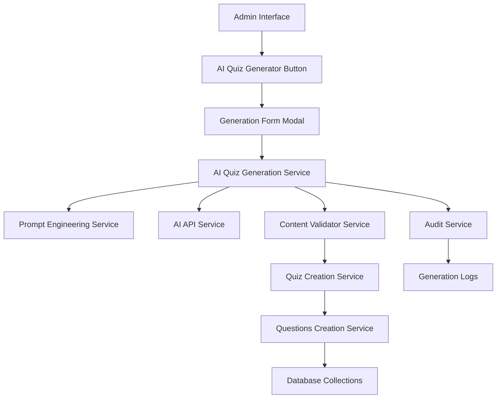
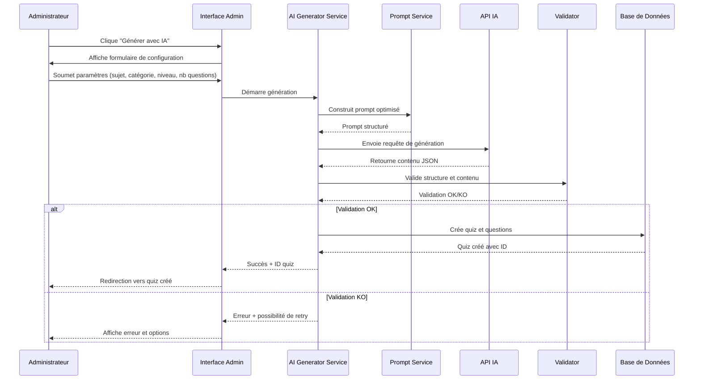

# Document de Design - Générateur de Quiz IA

## Vue d'ensemble

Le système de génération automatique de quiz par IA s'intègre dans l'interface d'administration Payload CMS pour permettre la création rapide de contenu éducatif de qualité. Il utilise des services IA externes, des validateurs de contenu, et des prompts optimisés pour générer des quiz médicaux adaptés aux niveaux PASS et LAS.

## Architecture

### Architecture Générale



### Flux de Génération



## Composants et Interfaces

### 1. Interface Utilisateur Admin

#### Bouton de Génération IA
```typescript
interface AIGenerationButtonProps {
  onGenerate: () => void;
  disabled?: boolean;
  loading?: boolean;
}
```

#### Modal de Configuration
```typescript
interface GenerationConfigModal {
  isOpen: boolean;
  onClose: () => void;
  onSubmit: (config: GenerationConfig) => void;
}

interface GenerationConfig {
  subject: string;           // 10-200 caractères
  categoryId: string;        // ID de catégorie existante
  studentLevel: 'PASS' | 'LAS' | 'both';
  questionCount: number;     // 5-20 questions
  difficulty: 'easy' | 'medium' | 'hard';
  includeExplanations: boolean;
}
```

#### Indicateur de Progrès
```typescript
interface GenerationProgress {
  step: 'configuring' | 'generating' | 'validating' | 'creating' | 'completed' | 'error';
  progress: number;          // 0-100
  message: string;
  error?: string;
}
```

### 2. Services Backend

#### AI Quiz Generation Service
```typescript
export class AIQuizGenerationService {
  constructor(
    private payload: Payload,
    private promptService: PromptEngineeringService,
    private aiService: AIAPIService,
    private validator: ContentValidatorService,
    private auditService: AuditService
  ) {}

  async generateQuiz(config: GenerationConfig, userId: string): Promise<GenerationResult> {
    // Orchestration complète de la génération
  }

  async validateConfig(config: GenerationConfig): Promise<ValidationResult> {
    // Validation des paramètres de configuration
  }

  private async createQuizFromAIContent(
    aiContent: AIGeneratedContent, 
    config: GenerationConfig
  ): Promise<Quiz> {
    // Création du quiz et des questions dans la base
  }
}
```

#### Prompt Engineering Service
```typescript
export class PromptEngineeringService {
  buildQuizGenerationPrompt(config: GenerationConfig): string {
    // Construction du prompt optimisé
  }

  private getMedicalContextPrompt(level: string): string {
    // Contexte spécialisé médical selon le niveau
  }

  private getStructurePrompt(questionCount: number): string {
    // Instructions pour la structure JSON attendue
  }
}
```

#### Content Validator Service
```typescript
export class ContentValidatorService {
  validateAIGeneratedQuiz(content: any): ValidationResult {
    // Validation complète du contenu généré
  }

  private validateQuizStructure(quiz: any): boolean {
    // Validation de la structure du quiz
  }

  private validateQuestions(questions: any[]): ValidationResult {
    // Validation de chaque question
  }

  private validateMedicalContent(content: string): boolean {
    // Validation spécifique au contenu médical
  }
}
```

### 3. Modèles de Données

#### Configuration de Génération
```typescript
interface GenerationConfig {
  subject: string;
  categoryId: string;
  studentLevel: 'PASS' | 'LAS' | 'both';
  questionCount: number;
  difficulty: 'easy' | 'medium' | 'hard';
  includeExplanations: boolean;
  customInstructions?: string;
}
```

#### Contenu Généré par IA
```typescript
interface AIGeneratedContent {
  quiz: {
    title: string;
    description: string;
    estimatedDuration: number;
  };
  questions: AIGeneratedQuestion[];
  metadata: {
    generatedAt: string;
    model: string;
    tokensUsed: number;
  };
}

interface AIGeneratedQuestion {
  questionText: string;
  options: {
    text: string;
    isCorrect: boolean;
  }[];
  explanation: string;
  difficulty: string;
  tags: string[];
}
```

#### Log de Génération
```typescript
interface GenerationLog {
  id: string;
  userId: string;
  config: GenerationConfig;
  status: 'started' | 'completed' | 'failed';
  result?: {
    quizId: string;
    questionsCreated: number;
    duration: number;
  };
  error?: {
    type: string;
    message: string;
    details: any;
  };
  createdAt: string;
  completedAt?: string;
}
```

## Prompts et IA

### Prompt Principal
```
Tu es un expert en éducation médicale spécialisé dans la création de QCM pour les étudiants en médecine.

CONTEXTE:
- Niveau: {studentLevel} (PASS = 1ère année, LAS = Licence Accès Santé)
- Sujet: {subject}
- Nombre de questions: {questionCount}
- Difficulté: {difficulty}

INSTRUCTIONS:
1. Crée {questionCount} questions de choix multiples (QCM)
2. Chaque question doit avoir exactement 4 options (A, B, C, D)
3. Une seule option correcte par question
4. Inclus une explication détaillée pour chaque réponse
5. Adapte le niveau de complexité au public {studentLevel}
6. Utilise un vocabulaire médical précis et approprié

FORMAT DE RÉPONSE (JSON strict):
{
  "quiz": {
    "title": "Titre descriptif du quiz",
    "description": "Description courte du contenu",
    "estimatedDuration": 15
  },
  "questions": [
    {
      "questionText": "Texte de la question",
      "options": [
        {"text": "Option A", "isCorrect": false},
        {"text": "Option B", "isCorrect": true},
        {"text": "Option C", "isCorrect": false},
        {"text": "Option D", "isCorrect": false}
      ],
      "explanation": "Explication détaillée de la bonne réponse",
      "difficulty": "{difficulty}",
      "tags": ["tag1", "tag2"]
    }
  ]
}

SUJET SPÉCIFIQUE: {subject}

{customInstructions}
```

### Prompts Spécialisés par Niveau

#### PASS (1ère année)
```
CONTEXTE PASS:
- Étudiants en première année de médecine
- Focus sur les bases fondamentales
- Anatomie, physiologie, biochimie de base
- Éviter les concepts cliniques avancés
- Privilégier la compréhension des mécanismes
```

#### LAS (Licence Accès Santé)
```
CONTEXTE LAS:
- Étudiants en licence avec option santé
- Niveau intermédiaire entre lycée et médecine
- Concepts médicaux accessibles
- Lien avec les sciences fondamentales
- Préparation aux études de santé
```

## Validation et Qualité

### Règles de Validation

#### Structure JSON
```typescript
const quizSchema = {
  quiz: {
    title: { type: 'string', minLength: 10, maxLength: 100 },
    description: { type: 'string', minLength: 20, maxLength: 300 },
    estimatedDuration: { type: 'number', min: 5, max: 60 }
  },
  questions: {
    type: 'array',
    minItems: 5,
    maxItems: 20,
    items: {
      questionText: { type: 'string', minLength: 20 },
      options: {
        type: 'array',
        items: 4,
        items: {
          text: { type: 'string', minLength: 5 },
          isCorrect: { type: 'boolean' }
        }
      },
      explanation: { type: 'string', minLength: 50 }
    }
  }
};
```

#### Validation Métier
1. **Une seule bonne réponse** par question
2. **Vocabulaire médical** approprié au niveau
3. **Cohérence** entre question et explication
4. **Absence de contenu** inapproprié ou dangereux
5. **Respect du sujet** demandé

### Gestion des Erreurs

#### Types d'Erreurs
```typescript
enum GenerationErrorType {
  INVALID_CONFIG = 'invalid_config',
  AI_API_ERROR = 'ai_api_error',
  VALIDATION_FAILED = 'validation_failed',
  DATABASE_ERROR = 'database_error',
  RATE_LIMIT_EXCEEDED = 'rate_limit_exceeded'
}
```

#### Stratégies de Récupération
1. **Retry automatique** pour les erreurs temporaires
2. **Ajustement du prompt** si validation échoue
3. **Fallback manuel** si échecs répétés
4. **Cache des prompts** réussis pour réutilisation

## Intégration Frontend

### Filtrage par Catégorie
```typescript
interface QuizFilter {
  categoryId?: string;
  studentLevel?: string;
  difficulty?: string;
  generatedByAI?: boolean;
}

interface QuizListComponent {
  filters: QuizFilter;
  onFilterChange: (filters: QuizFilter) => void;
  quizzes: Quiz[];
  loading: boolean;
}
```

### Interface de Découverte
```typescript
interface CategoryBrowser {
  categories: Category[];
  selectedCategory?: string;
  onCategorySelect: (categoryId: string) => void;
  quizCount: Record<string, number>;
}
```

## Sécurité et Performance

### Contrôles d'Accès
- **Authentification** administrateur requise
- **Limitation du taux** de génération (5 par heure)
- **Validation** des paramètres côté serveur
- **Audit** de toutes les générations

### Optimisations
- **Cache** des prompts fréquents
- **Génération asynchrone** avec WebSockets
- **Compression** des réponses IA
- **Index** de base de données optimisés

### Monitoring
- **Métriques** de génération (succès/échec)
- **Temps de réponse** de l'API IA
- **Qualité** du contenu généré
- **Utilisation** par catégorie et niveau