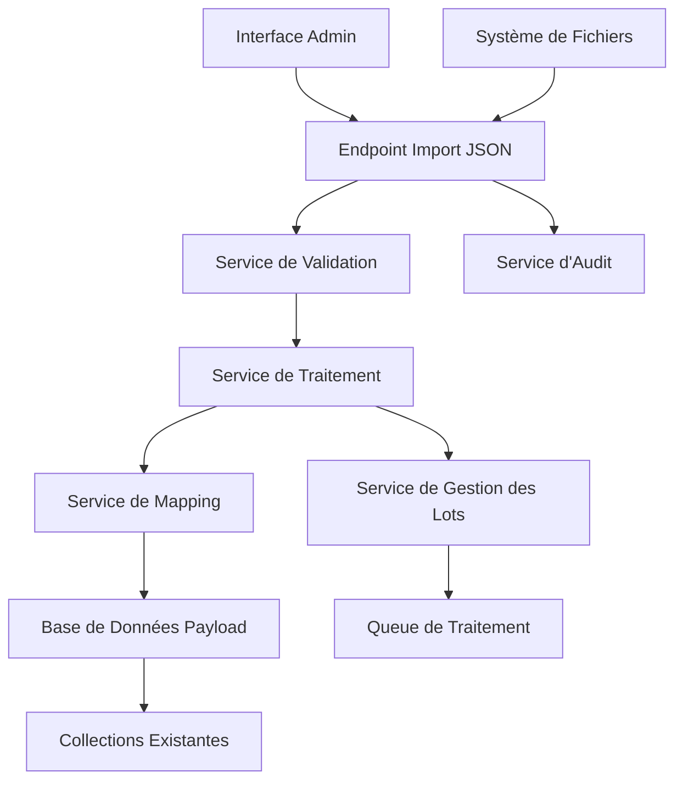
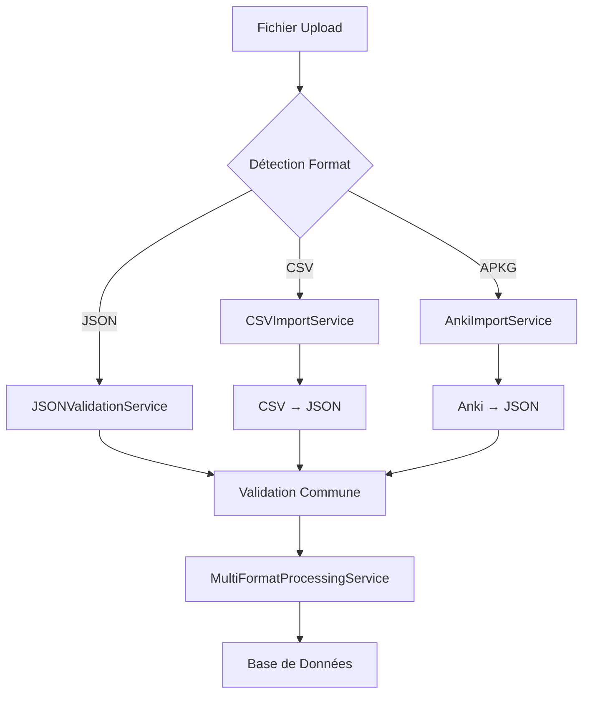
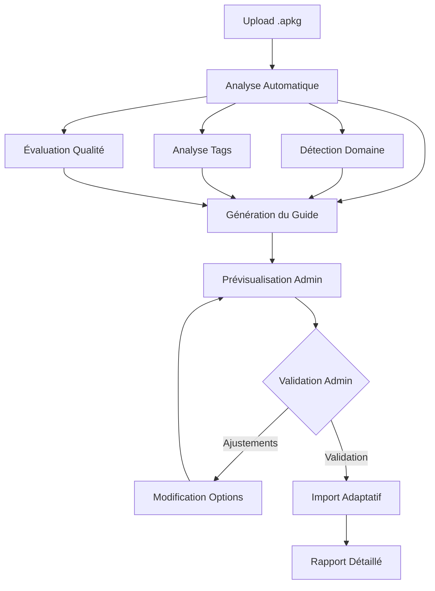
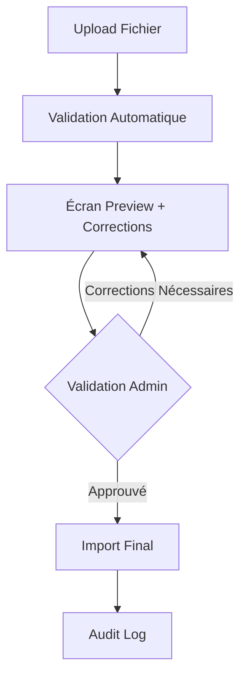

# Document de Conception

## Vue d'ensemble

Le Système d'Import JSON est une solution complète permettant l'importation en masse de contenu éducatif médical via des fichiers JSON structurés. Le système s'intègre parfaitement dans l'architecture existante de MedCoach, utilisant les collections Payload CMS existantes (Questions, Categories, Quizzes) et suivant les patterns établis pour les endpoints et services.

## Architecture

### Architecture Générale



### Intégration avec l'Architecture Existante

Le système s'appuie sur l'infrastructure existante :
- **Collections Payload** : Questions, Categories, Quizzes, Users
- **Services existants** : ValidationService, AuditLogService
- **Patterns d'endpoints** : Similaire à uploadDocument.ts
- **Système de permissions** : Utilise les rôles admin/superadmin existants

## Composants et Interfaces

### 1. Endpoint Principal - JSONImportEndpoint

**Localisation** : `src/endpoints/jsonImport.ts`

**Responsabilités** :
- Réception des fichiers JSON
- Validation initiale des permissions
- Orchestration du processus d'import
- Gestion des réponses asynchrones

**Interface** :
```typescript
interface ImportRequest {
  file: File; // Fichier JSON
  importType: 'questions' | 'quizzes' | 'flashcards' | 'learning-paths';
  options: {
    dryRun?: boolean;
    batchSize?: number;
    overwriteExisting?: boolean;
    categoryMapping?: Record<string, string>;
  };
}
```### 2. Servi
ce de Validation JSON - JSONValidationService

**Localisation** : `src/services/JSONValidationService.ts`

**Responsabilités** :
- Validation du schéma JSON
- Vérification de l'intégrité des données
- Détection des doublons
- Validation des références (catégories, cours)

**Schémas JSON Supportés** :

#### Questions Simples (MVP)
```json
{
  "version": "1.0",
  "type": "questions",
  "metadata": {
    "source": "Faculté de Médecine Paris",
    "created": "2025-01-15",
    "level": "PASS"
  },
  "questions": [
    {
      "questionText": "Quelle est la fonction principale du ventricule gauche ?",
      "options": [
        {"text": "Pomper le sang vers l'aorte", "isCorrect": true},
        {"text": "Recevoir le sang des veines", "isCorrect": false},
        {"text": "Filtrer le sang", "isCorrect": false},
        {"text": "Produire les globules rouges", "isCorrect": false}
      ],
      "explanation": "Le ventricule gauche pompe le sang oxygéné vers l'aorte...",
      "category": "Cardiologie",
      "difficulty": "medium",
      "level": "PASS",
      "tags": ["anatomie", "cœur", "circulation"]
    }
  ]
}
```

#### Format CSV Supporté
```csv
questionText,optionA,optionB,optionC,optionD,correctAnswer,explanation,category,difficulty,level,tags
"Quelle est la fonction principale du ventricule gauche ?","Pomper le sang vers l'aorte","Recevoir le sang des veines","Filtrer le sang","Produire les globules rouges","A","Le ventricule gauche pompe le sang oxygéné vers l'aorte...","Cardiologie","medium","PASS","anatomie,cœur,circulation"
```

#### Import Anki (.apkg)
Le système extrait automatiquement :
- **Cartes basiques** : Question/Réponse → QCM avec génération de distracteurs
- **Cartes cloze** : Texte à trous → Questions de complétion
- **Tags Anki** : Préservés comme tags MedCoach
- **Médias** : Images et audio extraits et associés
- **Statistiques** : Historique de révision converti en métadonnées
```

#### Parcours d'Apprentissage
```json
{
  "version": "1.0",
  "type": "learning-path",
  "metadata": {
    "title": "Cardiologie PASS - Semestre 1",
    "level": "PASS",
    "estimatedDuration": 120
  },
  "path": {
    "steps": [
      {
        "id": "step-1",
        "title": "Anatomie du cœur - Bases",
        "prerequisites": [],
        "questions": ["ref:question-1", "ref:question-2"]
      },
      {
        "id": "step-2", 
        "title": "Physiologie cardiaque",
        "prerequisites": ["step-1"],
        "questions": ["ref:question-3", "ref:question-4"]
      }
    ]
  }
}
```

### 3. Service de Traitement - JSONProcessingService

**Localisation** : `src/services/JSONProcessingService.ts`

**Responsabilités** :
- Parsing et transformation des données JSON
- Mapping vers les structures Payload CMS
- Gestion des références et relations
- Création des enregistrements en base

**Méthodes principales** :
```typescript
class JSONProcessingService {
  async processQuestions(data: QuestionImportData): Promise<ProcessingResult>
  async processLearningPaths(data: LearningPathData): Promise<ProcessingResult>
  async processFlashcards(data: FlashcardData): Promise<ProcessingResult>
  async mapCategories(categories: string[]): Promise<CategoryMapping>
}
```

### 4. Service de Gestion des Lots - BatchProcessingService

**Localisation** : `src/services/BatchProcessingService.ts`

**Responsabilités** :
- Traitement par chunks pour les gros volumes
- Gestion de la progression
- Pause/reprise des imports
- Gestion des erreurs partielles

**Fonctionnalités** :
- Traitement asynchrone avec queue
- Suivi de progression en temps réel
- Rollback en cas d'échec critique
- Rapports détaillés d'import

### 5. Service de Mapping - ContentMappingService

**Localisation** : `src/services/ContentMappingService.ts`

**Responsabilités** :
- Mapping des champs JSON vers les champs Payload
- Résolution des références (catégories, cours)
- Transformation des formats (RichText, etc.)
- Assignation automatique des métadonnées

**Transformations principales** :
- Texte simple → RichText Lexical
- Références string → Relations Payload
- Métadonnées → Champs structurés

## Modèles de Données

### Structure d'Import Unifiée

```typescript
interface ImportJob {
  id: string;
  userId: string;
  fileName: string;
  importType: ImportType;
  status: 'queued' | 'processing' | 'completed' | 'failed' | 'paused';
  progress: {
    total: number;
    processed: number;
    successful: number;
    failed: number;
  };
  options: ImportOptions;
  results: ImportResult[];
  errors: ImportError[];
  createdAt: Date;
  completedAt?: Date;
}
```

### Résultats d'Import

```typescript
interface ImportResult {
  type: 'question' | 'quiz' | 'flashcard' | 'learning-path';
  sourceIndex: number;
  payloadId?: string;
  status: 'success' | 'error' | 'skipped';
  message?: string;
  warnings?: string[];
}
```

## Gestion des Erreurs

### Stratégie de Gestion d'Erreurs

1. **Erreurs de Validation** : Arrêt immédiat avec rapport détaillé
2. **Erreurs Partielles** : Continuation avec logging des échecs
3. **Erreurs Critiques** : Rollback automatique si possible
4. **Erreurs de Réseau/DB** : Retry automatique avec backoff

### Types d'Erreurs

```typescript
interface ImportError {
  type: 'validation' | 'database' | 'mapping' | 'reference' | 'system';
  severity: 'critical' | 'major' | 'minor' | 'warning';
  itemIndex?: number;
  field?: string;
  message: string;
  suggestion?: string;
}
```

## Stratégie de Test

### Tests Unitaires
- Validation des schémas JSON
- Transformation des données
- Mapping des champs
- Gestion des erreurs

### Tests d'Intégration
- Import complet de fichiers de test
- Vérification de l'intégrité des données
- Performance sur gros volumes
- Rollback et récupération

### Tests de Performance
- Import de 1000+ questions
- Traitement concurrent
- Utilisation mémoire
- Temps de réponse

### Jeux de Données de Test

1. **questions-simple.json** : 10 questions basiques
2. **questions-large.json** : 500 questions avec métadonnées
3. **learning-path-complete.json** : Parcours avec prérequis
4. **flashcards-anki.json** : Export Anki converti
5. **mixed-content.json** : Questions + parcours + flashcards
6. **invalid-schema.json** : Données malformées pour tests d'erreur

## Sécurité et Permissions

### Contrôle d'Accès
- Import limité aux rôles admin/superadmin
- Audit complet de toutes les opérations
- Validation des permissions sur les collections cibles

### Validation des Données
- Sanitisation des entrées utilisateur
- Validation des tailles de fichiers (max 10MB)
- Limitation du nombre d'éléments par import (max 1000)
- Vérification des types MIME

### Audit et Traçabilité
- Log de tous les imports avec détails utilisateur
- Historique des modifications
- Possibilité de rollback avec justification
- Rapports d'activité pour les administrateurs

## Intégration avec l'Écosystème Existant

### Collections Payload Utilisées
- **Questions** : Création directe avec tous les champs
- **Categories** : Résolution et création automatique si nécessaire  
- **Quizzes** : Assemblage automatique de questions importées
- **Users** : Attribution des créations à l'utilisateur importateur

### Services Existants Réutilisés
- **ValidationService** : Validation des paramètres
- **AuditLogService** : Logging des opérations
- **AIQuizGenerationService** : Enrichissement automatique si demandé

### Endpoints Complémentaires
- `/api/json-import/upload` : Upload et traitement
- `/api/json-import/status/:jobId` : Suivi de progression
- `/api/json-import/history` : Historique des imports
- `/api/json-import/templates` : Téléchargement de templates JSON
## Suppo
rt Multi-Formats (CSV et Anki)

### Service CSV - CSVImportService

**Localisation** : `src/services/CSVImportService.ts`

**Responsabilités** :
- Parsing des fichiers CSV avec détection automatique des délimiteurs
- Validation des colonnes requises et optionnelles
- Conversion CSV → JSON interne pour traitement unifié
- Gestion des encodages multiples (UTF-8, ISO-8859-1, Windows-1252)
- Support des guillemets et caractères d'échappement

**Structure CSV Attendue** :
```csv
questionText,optionA,optionB,optionC,optionD,correctAnswer,explanation,category,difficulty,level,tags
```

**Fonctionnalités** :
- **Auto-détection** : Reconnaissance automatique du format CSV
- **Validation flexible** : Colonnes optionnelles avec valeurs par défaut
- **Nettoyage automatique** : Suppression des espaces et caractères indésirables
- **Mapping intelligent** : Correspondance automatique des noms de colonnes variants

### Service Anki - AnkiImportService

**Localisation** : `src/services/AnkiImportService.ts`

**Responsabilités** :
- Extraction des fichiers .apkg (archives ZIP)
- Parsing de la base de données SQLite Anki
- Conversion des types de cartes Anki vers questions MedCoach
- Extraction et gestion des fichiers média
- Préservation des métadonnées et statistiques

**Types de Cartes Supportés** :
1. **Cartes Basiques** : Front/Back → QCM avec génération automatique de distracteurs
2. **Cartes Cloze** : Texte à trous → Questions de complétion
3. **Cartes Image Occlusion** : Images avec zones masquées → Questions visuelles

**Métadonnées Préservées** :
- Tags Anki → Tags MedCoach
- Intervalles de révision → Métadonnées de difficulté
- Statistiques de performance → Données d'analyse
- Deck hierarchy → Structure de catégories

**Gestion des Médias** :
- Extraction automatique des images/audio
- Upload vers la collection Media de Payload
- Association correcte avec les questions créées
- Optimisation des formats (WebP, compression audio)

### Endpoint Multi-Format

**Extension de l'endpoint principal** :
```typescript
interface MultiFormatImportRequest {
  file: File; // JSON, CSV, ou .apkg
  importType: 'questions' | 'quizzes' | 'flashcards' | 'learning-paths' | 'anki-deck';
  format: 'json' | 'csv' | 'anki'; // Détection automatique si non spécifié
  csvOptions?: {
    delimiter?: ',' | ';' | '\t';
    encoding?: 'utf-8' | 'iso-8859-1' | 'windows-1252';
    hasHeader?: boolean;
  };
  ankiOptions?: {
    generateDistractors?: boolean; // Génération auto de distracteurs pour cartes basiques
    preserveScheduling?: boolean; // Préserver les intervalles de révision
    convertCloze?: boolean; // Convertir les cartes cloze en QCM
  };
}
```

### Flux de Traitement Unifié



### Avantages de l'Approche Multi-Format

1. **Flexibilité** : Support des formats les plus utilisés par les éducateurs
2. **Migration facile** : Import direct depuis Excel/Anki sans conversion manuelle
3. **Préservation des données** : Métadonnées et historiques conservés
4. **Workflow unifié** : Même pipeline de validation et traitement
5. **Extensibilité** : Architecture prête pour d'autres formats (Excel, Moodle, etc.)

Cette extension transforme le système d'import JSON en véritable hub de migration de contenus éducatifs !

## Adaptation Intelligente aux Decks Anki Existants

### Problématique des Decks Anki Variés

Les decks Anki médicaux existants ont des structures très hétérogènes :
- **Formats de cartes** : Basic, Cloze, Image Occlusion, personnalisés
- **Conventions de nommage** : Tags variés, hiérarchies différentes
- **Qualité variable** : Certains decks bien structurés, d'autres chaotiques
- **Langues mixtes** : Français/anglais/latin médical
- **Médias divers** : Images, schémas, audio d'auscultation

### Système d'Adaptation Intelligent

#### 1. Analyse Automatique du Deck

**Phase de Reconnaissance** :
```typescript
interface AnkiDeckAnalysis {
  deckInfo: {
    name: string;
    cardCount: number;
    noteTypes: string[];
    mediaFiles: string[];
    language: 'fr' | 'en' | 'mixed';
    medicalDomain: string; // Détecté automatiquement
  };
  cardTypeDistribution: {
    basic: number;
    cloze: number;
    imageOcclusion: number;
    custom: number;
  };
  tagAnalysis: {
    commonTags: string[];
    hierarchicalStructure: boolean;
    medicalCategories: string[];
  };
  qualityScore: number; // 0-100
  recommendations: string[];
}
```

**Détection Automatique** :
- **Domaine médical** : Analyse du contenu pour identifier (cardiologie, anatomie, etc.)
- **Niveau d'études** : Détection PASS/LAS basée sur la complexité
- **Structure existante** : Reconnaissance des patterns de tags et hiérarchies

#### 2. Mapping Intelligent des Structures

**Conversion des Types de Cartes** :

```typescript
// Carte Anki Basic → Question MedCoach
{
  front: "Quelle est la fonction du ventricule gauche ?",
  back: "Pomper le sang oxygéné vers l'aorte et la circulation systémique"
}
↓
{
  questionText: "Quelle est la fonction du ventricule gauche ?",
  options: [
    { text: "Pomper le sang oxygéné vers l'aorte", isCorrect: true },
    { text: "Recevoir le sang veineux", isCorrect: false }, // Généré par IA
    { text: "Filtrer le sang", isCorrect: false }, // Généré par IA
    { text: "Réguler la pression artérielle", isCorrect: false } // Généré par IA
  ],
  explanation: "Le ventricule gauche pompe le sang oxygéné vers l'aorte..."
}
```

**Gestion des Cartes Cloze** :
```typescript
// Carte Anki Cloze
"Le {{c1::ventricule gauche}} pompe le sang vers {{c2::l'aorte}}"
↓
// Option 1: Question à trous
{
  questionText: "Le _____ pompe le sang vers _____",
  type: "fill-in-blanks",
  answers: ["ventricule gauche", "l'aorte"]
}
// Option 2: QCM généré
{
  questionText: "Quelle structure pompe le sang vers l'aorte ?",
  options: [
    { text: "Ventricule gauche", isCorrect: true },
    { text: "Ventricule droit", isCorrect: false },
    { text: "Oreillette gauche", isCorrect: false },
    { text: "Oreillette droite", isCorrect: false }
  ]
}
```

#### 3. Système de Tags Intelligent

**Mapping Automatique des Tags Anki** :

```typescript
interface TagMappingRules {
  // Tags Anki courants → Catégories MedCoach
  ankiToMedcoach: {
    "cardio": "Cardiologie",
    "anatomy": "Anatomie",
    "physio": "Physiologie",
    "PASS": "PASS",
    "LAS": "LAS",
    "heart": "Cardiologie",
    "coeur": "Cardiologie"
  };
  
  // Détection de patterns
  patterns: {
    difficulty: /^(easy|medium|hard|facile|moyen|difficile)$/i,
    year: /^(PASS|LAS|L[1-3]|M[1-2])$/i,
    specialty: /^(cardio|neuro|pneumo|gastro|endo)$/i
  };
  
  // Règles de hiérarchie
  hierarchy: {
    "Médecine::Cardiologie::Anatomie" → ["Cardiologie", "Anatomie"],
    "PASS::Semestre1::Cardio" → ["PASS", "Cardiologie"]
  };
}
```

#### 4. Guide d'Import Adaptatif pour l'Admin

**Interface de Pré-visualisation** :
```typescript
interface AnkiImportPreview {
  deckAnalysis: AnkiDeckAnalysis;
  conversionOptions: {
    generateDistractors: boolean; // Générer des distracteurs IA
    preserveOriginalTags: boolean; // Garder les tags Anki originaux
    autoCategories: boolean; // Assignation automatique des catégories
    convertClozeToQCM: boolean; // Convertir cloze en QCM
    extractMedia: boolean; // Extraire les médias
  };
  mappingPreview: {
    categories: Array<{
      ankiTag: string;
      suggestedCategory: string;
      confidence: number;
    }>;
    sampleConversions: Array<{
      originalCard: AnkiCard;
      convertedQuestion: Question;
      conversionType: string;
    }>;
  };
  warnings: string[];
  recommendations: string[];
}
```

**Guide Contextuel pour l'Admin** :

1. **Analyse Automatique** :
   ```
   ✅ Deck analysé : "Cardiologie PASS 2024"
   📊  247 cartes détectées (180 basic, 67 cloze)
   🎯 Domaine identifié : Cardiologie (95% confiance)
   📚 Niveau détecté : PASS (87% confiance)
   🏷️ 15 tags principaux trouvés
   ```

2. **Recommandations Personnalisées** :
   ```
   💡 Recommandations pour ce deck :
   ✓ Activer la génération de distracteurs (cartes basic simples)
   ✓ Convertir les cartes cloze en QCM (meilleure intégration)
   ⚠️ 12 cartes avec médias manquants détectées
   ℹ️ Tags "cardio" et "heart" seront mappés vers "Cardiologie"
   ```

3. **Options de Conversion Suggérées** :
   ```typescript
   const suggestedOptions = {
     generateDistractors: true, // Recommandé pour ce deck
     preserveOriginalTags: false, // Tags peu structurés
     autoCategories: true, // Bonne détection automatique
     convertClozeToQCM: true, // Améliore l'expérience utilisateur
     extractMedia: true // 45 images détectées
   };
   ```

#### 5. Gestion des Cas Complexes

**Decks Mal Structurés** :
- **Détection automatique** des problèmes (tags incohérents, cartes dupliquées)
- **Suggestions de nettoyage** avant import
- **Import partiel** avec rapport des cartes problématiques
- **Mode de récupération** pour sauver le maximum de contenu

**Decks Multilingues** :
- **Détection de langue** par carte
- **Séparation automatique** français/anglais/latin
- **Traduction suggérée** pour les termes anglais courants
- **Préservation** des termes latins médicaux

**Decks avec Médias Complexes** :
- **Extraction intelligente** des images/audio
- **Optimisation automatique** (compression, formats web)
- **Détection des schémas anatomiques** pour catégorisation
- **Gestion des références manquantes** avec placeholders

#### 6. Workflow d'Import Adaptatif



### Avantages de cette Approche

1. **Zéro Configuration** : L'admin n'a pas besoin de connaître la structure Anki
2. **Intelligence Contextuelle** : Adaptation automatique au contenu médical
3. **Préservation Maximale** : Aucune perte de données importantes
4. **Amélioration Automatique** : Enrichissement du contenu lors de l'import
5. **Flexibilité** : Options d'ajustement pour les cas particuliers

Cette approche transforme l'import Anki en une expérience **"plug-and-play"** où l'admin upload simplement son deck et le système s'occupe intelligemment de l'adaptation !#
# Guide de Structure JSON pour l'Admin

### Templates JSON Interactifs

L'interface admin proposera des **templates JSON pré-configurés** selon le type de contenu :

#### 1. Template Questions Simples
```json
{
  "version": "1.0",
  "type": "questions",
  "metadata": {
    "source": "Votre établissement",
    "created": "2025-01-15",
    "level": "PASS", // ou "LAS" ou "both"
    "description": "Description de votre lot de questions"
  },
  "questions": [
    {
      "questionText": "Votre question ici...",
      "options": [
        {"text": "Option A", "isCorrect": true},
        {"text": "Option B", "isCorrect": false},
        {"text": "Option C", "isCorrect": false},
        {"text": "Option D", "isCorrect": false}
      ],
      "explanation": "Explication détaillée de la réponse...",
      "category": "Nom de la catégorie", // Doit exister ou sera créée
      "difficulty": "easy", // "easy", "medium", "hard"
      "level": "PASS", // "PASS", "LAS", "both"
      "tags": ["tag1", "tag2", "tag3"] // Optionnel
    }
    // Ajouter d'autres questions...
  ]
}
```

#### 2. Template Parcours d'Apprentissage
```json
{
  "version": "1.0",
  "type": "learning-path",
  "metadata": {
    "title": "Cardiologie PASS - Semestre 1",
    "level": "PASS",
    "estimatedDuration": 120, // en minutes
    "description": "Parcours progressif en cardiologie"
  },
  "path": {
    "steps": [
      {
        "id": "anatomie-coeur",
        "title": "Anatomie du cœur - Bases",
        "description": "Structures anatomiques fondamentales",
        "prerequisites": [], // Vide pour la première étape
        "estimatedTime": 30,
        "questions": [
          // Questions inline ou références
          {
            "questionText": "Question spécifique à cette étape...",
            "options": [...],
            "explanation": "..."
          }
        ]
      },
      {
        "id": "physiologie-cardiaque",
        "title": "Physiologie cardiaque",
        "description": "Fonctionnement du système cardiovasculaire",
        "prerequisites": ["anatomie-coeur"], // Référence à l'étape précédente
        "estimatedTime": 45,
        "questions": [...]
      }
    ]
  }
}
```

#### 3. Template Flashcards
```json
{
  "version": "1.0",
  "type": "flashcards",
  "metadata": {
    "deckName": "Anatomie Cardiaque PASS",
    "level": "PASS",
    "category": "Cardiologie",
    "description": "Flashcards pour révision anatomie"
  },
  "cards": [
    {
      "front": "Quelle est la fonction du ventricule gauche ?",
      "back": "Pomper le sang oxygéné vers l'aorte et la circulation systémique",
      "category": "Cardiologie",
      "difficulty": "easy",
      "tags": ["anatomie", "cœur", "ventricule"],
      "imageUrl": "/media/ventricule-gauche.png" // Optionnel
    }
  ]
}
```

### Interface de Création Guidée

#### Assistant de Structure JSON

L'admin aura accès à un **assistant interactif** :

```typescript
interface JSONStructureWizard {
  steps: [
    {
      title: "Type de contenu",
      options: ["Questions simples", "Parcours d'apprentissage", "Flashcards"],
      description: "Quel type de contenu souhaitez-vous importer ?"
    },
    {
      title: "Métadonnées générales",
      fields: {
        source: "string",
        level: "PASS | LAS | both",
        category: "select from existing",
        description: "textarea"
      }
    },
    {
      title: "Structure du contenu",
      dynamic: true, // Adapté selon le type choisi
      preview: true // Aperçu JSON en temps réel
    }
  ];
}
```

#### Validation en Temps Réel

```typescript
interface JSONValidator {
  validateAsYouType: boolean;
  showErrors: {
    syntax: boolean;
    schema: boolean;
    business: boolean; // Règles métier (catégories existantes, etc.)
  };
  suggestions: {
    autoComplete: boolean; // Auto-complétion des catégories
    smartDefaults: boolean; // Valeurs par défaut intelligentes
    errorFixes: boolean; // Suggestions de correction
  };
}
```

### Adaptation Contextuelle selon la Source

#### Pour les Migrations Excel/CSV
```json
{
  "migrationHelper": {
    "csvMapping": {
      "questionText": "Colonne A",
      "optionA": "Colonne B",
      "optionB": "Colonne C",
      "correctAnswer": "Colonne F",
      "explanation": "Colonne G"
    },
    "autoGenerate": {
      "metadata": true,
      "categories": true,
      "tags": "from content analysis"
    }
  }
}
```

#### Pour les Imports Anki
```json
{
  "ankiAdapter": {
    "preserveOriginal": {
      "tags": true,
      "scheduling": false,
      "media": true
    },
    "enhance": {
      "generateDistractors": true,
      "addExplanations": true,
      "categorizeAuto": true
    }
  }
}
```

### Documentation Interactive

#### Exemples Contextuels
- **Tooltips explicatifs** sur chaque champ JSON
- **Exemples médicaux réels** pour chaque type de question
- **Cas d'usage typiques** par spécialité médicale
- **Erreurs courantes** et leurs corrections

#### Validation Pré-Import
```typescript
interface PreImportValidation {
  checks: {
    jsonSyntax: boolean;
    requiredFields: boolean;
    categoryExists: boolean;
    duplicateDetection: boolean;
    contentQuality: boolean; // Longueur des questions, cohérence
  };
  warnings: string[];
  suggestions: string[];
  estimatedImportTime: number;
}
```

Cette approche garantit que l'admin peut facilement structurer ses données JSON **sans expertise technique**, tout en bénéficiant d'une **adaptation intelligente** pour les formats existants comme Anki !

Le système devient ainsi accessible aux éducateurs médicaux, quel que soit leur niveau technique ou le format de leurs contenus existants.
## Su
pport CSV et Workflow de Validation (Mise à Jour)

### Service CSV - CSVImportService (MVP Focus)

**Localisation** : `src/services/CSVImportService.ts`

**Responsabilités** :
- Parsing des fichiers CSV avec détection automatique des délimiteurs
- Validation des colonnes requises et optionnelles
- Conversion CSV → JSON interne pour traitement unifié
- Gestion des encodages multiples (UTF-8, ISO-8859-1, Windows-1252)

**Structure CSV Simplifiée** :
```csv
questionText,optionA,optionB,optionC,optionD,correctAnswer,explanation,category,difficulty,level,tags
```

**Alternative Anki Pragmatique** : 
- Export CSV depuis Anki → Import CSV dans MedCoach
- Utilisateur contrôle la conversion
- Implémentation 10x plus simple
- Même résultat final sans complexité .apkg

### Workflow de Validation Humaine Obligatoire



**Étapes Critiques** :
1. **Upload** : Drag & drop + sélection format
2. **Validation automatique** : Détection erreurs techniques
3. **Preview avec corrections suggérées** : ⚠️ **ÉTAPE CRITIQUE**
4. **Validation admin manuelle** : ⚠️ **OBLIGATOIRE**
5. **Import final** : Création en base après validation

### Gestion Intelligente des Catégories

**Problème** : Éviter la pollution avec catégories mal nommées/dupliquées

**Solution** :
```typescript
interface CategoryMappingService {
  // Détection de similarité
  findSimilarCategories(newCategory: string): CategorySuggestion[];
  
  // Mapping intelligent
  suggestCategoryMapping(categories: string[]): CategoryMapping[];
  
  // Validation obligatoire
  requireAdminApproval(newCategories: string[]): boolean;
}
```

**Fonctionnalités** :
- **Détection de doublons** : "Cardiologie" vs "cardiologie" vs "CARDIOLOGIE"
- **Suggestions de fusion** : Analyse sémantique des noms
- **Validation administrative** : Aucune création automatique
- **Historique des mappings** : Cohérence entre imports

## Interface Utilisateur Payload-Native

### Écrans Clés (100% Compatible Payload)

**1. Écran Upload**
- Utilisation du composant `Upload` natif Payload
- Drag & drop intégré
- Validation des types MIME
- Sélection format avec radio buttons Payload

**2. Écran Validation**
- Composant `Table` Payload pour rapport d'erreurs
- `Alert` components pour corrections suggérées
- Pagination native pour gros volumes
- Actions bulk avec `Button` components

**3. Écran Preview**
- `DataTable` Payload pour aperçu des données
- `Tabs` pour organiser par type (questions, catégories, etc.)
- `Badge` components pour statuts de validation
- `Modal` pour édition en ligne

**4. Écran Progression**
- `ProgressBar` natif Payload
- `LivePreview` pour logs temps réel
- `Status` indicators intégrés
- Refresh automatique avec hooks Payload

**5. Écran Historique**
- `ListView` avec filtres natifs
- `DatePicker` pour plages temporelles
- `StatusField` pour statuts d'import
- Export des rapports avec `ExportButton`

### Architecture UI Payload-First

```typescript
// Utilisation maximale des composants Payload existants
import { 
  Upload, Table, Alert, Button, DataTable, 
  Tabs, Badge, Modal, ProgressBar, ListView 
} from 'payload/components';

// Éviter le CSS custom - utiliser les classes Payload
const ImportInterface = () => (
  <div className="payload-admin-panel">
    <Upload 
      collection="import-files"
      accept=".json,.csv"
      multiple={false}
    />
    <Table 
      data={validationResults}
      columns={validationColumns}
    />
  </div>
);
```

## Stratégie de Tests et Qualité

### Structure des Fixtures de Test

```
/test/fixtures/
├── valid/
│   ├── questions-simple.json (10 questions)
│   ├── questions-large.json (500 questions)
│   ├── learning-path.json
│   ├── flashcards.json
│   └── valid-csv-export.csv
├── invalid/
│   ├── malformed-json.json
│   ├── missing-fields.json
│   ├── invalid-categories.json
│   ├── duplicate-questions.json
│   └── invalid-csv-structure.csv
└── edge-cases/
    ├── unicode-characters.json
    ├── very-long-text.json
    ├── special-medical-terms.json
    └── mixed-encodings.csv
```

### Tests Prioritaires (MVP)

1. **Tests de Validation** : Tous les cas d'erreur avec fixtures
2. **Tests d'Intégration** : Workflow complet upload → validation → import
3. **Tests de Performance** : 500+ questions sans dégradation
4. **Tests UI** : Compatibilité composants Payload
5. **Tests de Sécurité** : Validation permissions et sanitisation

Cette approche pragmatique garantit un ROI immédiat tout en maintenant la qualité médicale !