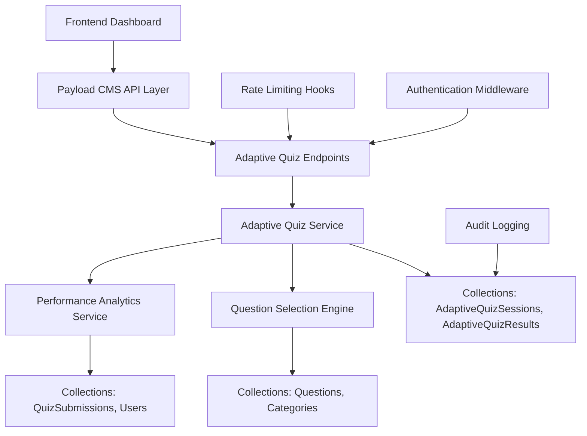
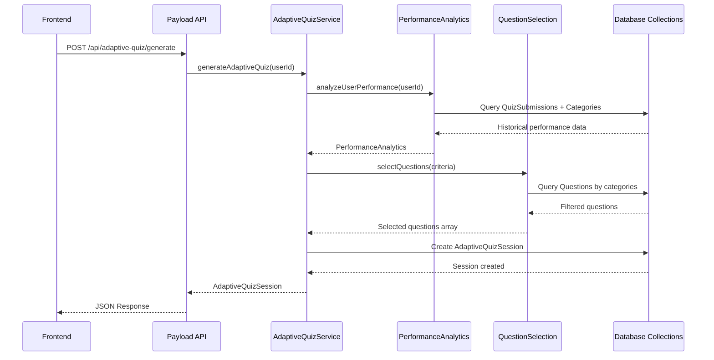

# Document de Design - Quiz Adaptatif Backend (Payload CMS)

## Vue d'ensemble

Le système backend Quiz Adaptatif pour Payload CMS est conçu pour fournir une infrastructure robuste et scalable pour les fonctionnalités de quiz personnalisés. Il s'intègre parfaitement avec l'architecture existante de Payload CMS en étendant les collections existantes et en ajoutant de nouveaux services spécialisés. Le système utilise les capacités natives de Payload pour la gestion des données, l'authentification, et les API REST/GraphQL.

## Architecture

### Architecture Générale Backend



### Flux de Données Backend



## Collections et Modèles de Données

### 1. Extensions des Collections Existantes

#### Questions Collection (Étendue)

```typescript
export const Questions: CollectionConfig = {
  slug: 'questions',
  fields: [
    // ... champs existants
    {
      name: 'category',
      type: 'relationship',
      relationTo: 'categories',
      required: true,
      hasMany: false,
      admin: {
        description: 'Catégorie principale de cette question pour l\'analyse adaptative'
      }
    },
    {
      name: 'difficulty',
      type: 'select',
      required: true,
      defaultValue: 'medium',
      options: [
        { label: 'Facile', value: 'easy' },
        { label: 'Moyen', value: 'medium' },
        { label: 'Difficile', value: 'hard' }
      ],
      admin: {
        description: 'Niveau de difficulté pour la sélection adaptative'
      }
    },
    {
      name: 'studentLevel',
      type: 'select',
      required: true,
      defaultValue: 'both',
      options: [
        { label: 'PASS uniquement', value: 'PASS' },
        { label: 'LAS uniquement', value: 'LAS' },
        { label: 'PASS et LAS', value: 'both' }
      ],
      admin: {
        description: 'Niveau d\'études ciblé par cette question'
      }
    },
    {
      name: 'tags',
      type: 'array',
      admin: {
        description: 'Tags pour filtrage et recherche avancée'
      },
      fields: [
        {
          name: 'tag',
          type: 'text',
          required: true
        }
      ]
    },
    {
      name: 'adaptiveMetadata',
      type: 'group',
      admin: {
        description: 'Métadonnées spécifiques aux quiz adaptatifs'
      },
      fields: [
        {
          name: 'averageTimeSeconds',
          type: 'number',
          admin: {
            description: 'Temps moyen de réponse en secondes'
          }
        },
        {
          name: 'successRate',
          type: 'number',
          min: 0,
          max: 1,
          admin: {
            description: 'Taux de réussite global (0-1)'
          }
        },
        {
          name: 'timesUsed',
          type: 'number',
          defaultValue: 0,
          admin: {
            description: 'Nombre de fois utilisée dans des quiz adaptatifs'
          }
        }
      ]
    }
  ]
}
```

#### Categories Collection (Étendue)

```typescript
export const Categories: CollectionConfig = {
  slug: 'categories',
  fields: [
    // ... champs existants
    {
      name: 'parentCategory',
      type: 'relationship',
      relationTo: 'categories',
      hasMany: false,
      admin: {
        description: 'Catégorie parent pour hiérarchie'
      }
    },
    {
      name: 'level',
      type: 'select',
      required: true,
      defaultValue: 'both',
      options: [
        { label: 'PASS uniquement', value: 'PASS' },
        { label: 'LAS uniquement', value: 'LAS' },
        { label: 'PASS et LAS', value: 'both' }
      ]
    },
    {
      name: 'adaptiveSettings',
      type: 'group',
      fields: [
        {
          name: 'isActive',
          type: 'checkbox',
          defaultValue: true,
          admin: {
            description: 'Inclure cette catégorie dans l\'analyse adaptative'
          }
        },
        {
          name: 'minimumQuestions',
          type: 'number',
          defaultValue: 5,
          admin: {
            description: 'Nombre minimum de questions requises pour l\'analyse'
          }
        },
        {
          name: 'weight',
          type: 'number',
          defaultValue: 1,
          min: 0.1,
          max: 3,
          admin: {
            description: 'Poids dans l\'algorithme de sélection (1 = normal)'
          }
        }
      ]
    }
  ]
}
```

### 2. Nouvelles Collections

#### AdaptiveQuizSessions Collection

```typescript
export const AdaptiveQuizSessions: CollectionConfig = {
  slug: 'adaptiveQuizSessions',
  admin: {
    useAsTitle: 'sessionId',
    defaultColumns: ['user', 'createdAt', 'status', 'questionsCount'],
    description: 'Sessions de quiz adaptatifs générées pour les étudiants'
  },
  access: {
    create: authenticated,
    read: ({ req: { user } }) => {
      if (user?.role === 'admin') return true
      return { user: { equals: user?.id } }
    },
    update: authenticated,
    delete: authenticated
  },
  fields: [
    {
      name: 'sessionId',
      type: 'text',
      required: true,
      unique: true,
      admin: {
        readOnly: true
      }
    },
    {
      name: 'user',
      type: 'relationship',
      relationTo: 'users',
      required: true,
      hasMany: false
    },
    {
      name: 'questions',
      type: 'relationship',
      relationTo: 'questions',
      required: true,
      hasMany: true,
      admin: {
        description: 'Questions sélectionnées pour ce quiz adaptatif'
      }
    },
    {
      name: 'status',
      type: 'select',
      required: true,
      defaultValue: 'active',
      options: [
        { label: 'Actif', value: 'active' },
        { label: 'Terminé', value: 'completed' },
        { label: 'Abandonné', value: 'abandoned' },
        { label: 'Expiré', value: 'expired' }
      ]
    },
    {
      name: 'basedOnAnalytics',
      type: 'group',
      admin: {
        description: 'Données d\'analyse ayant servi à générer ce quiz'
      },
      fields: [
        {
          name: 'weakCategories',
          type: 'relationship',
          relationTo: 'categories',
          hasMany: true,
          admin: {
            description: 'Catégories identifiées comme faibles'
          }
        },
        {
          name: 'strongCategories',
          type: 'relationship',
          relationTo: 'categories',
          hasMany: true,
          admin: {
            description: 'Catégories identifiées comme fortes'
          }
        },
        {
          name: 'analysisDate',
          type: 'date',
          required: true,
          admin: {
            description: 'Date de l\'analyse des performances'
          }
        },
        {
          name: 'overallSuccessRate',
          type: 'number',
          min: 0,
          max: 1,
          admin: {
            description: 'Taux de réussite global de l\'étudiant'
          }
        },
        {
          name: 'totalQuizzesAnalyzed',
          type: 'number',
          admin: {
            description: 'Nombre de quiz pris en compte dans l\'analyse'
          }
        }
      ]
    },
    {
      name: 'questionDistribution',
      type: 'group',
      admin: {
        description: 'Répartition des questions dans ce quiz'
      },
      fields: [
        {
          name: 'weakCategoryQuestions',
          type: 'number',
          required: true,
          admin: {
            description: 'Nombre de questions des catégories faibles'
          }
        },
        {
          name: 'strongCategoryQuestions',
          type: 'number',
          required: true,
          admin: {
            description: 'Nombre de questions des catégories fortes'
          }
        },
        {
          name: 'totalQuestions',
          type: 'number',
          required: true,
          admin: {
            description: 'Nombre total de questions'
          }
        }
      ]
    },
    {
      name: 'config',
      type: 'group',
      admin: {
        description: 'Configuration utilisée pour générer ce quiz'
      },
      fields: [
        {
          name: 'weakQuestionsCount',
          type: 'number',
          defaultValue: 5
        },
        {
          name: 'strongQuestionsCount',
          type: 'number',
          defaultValue: 2
        },
        {
          name: 'targetSuccessRate',
          type: 'number',
          defaultValue: 0.6
        }
      ]
    },
    {
      name: 'studentLevel',
      type: 'select',
      required: true,
      options: [
        { label: 'PASS', value: 'PASS' },
        { label: 'LAS', value: 'LAS' }
      ]
    },
    {
      name: 'expiresAt',
      type: 'date',
      admin: {
        description: 'Date d\'expiration de cette session'
      }
    }
  ],
  hooks: {
    beforeChange: [
      ({ data, operation }) => {
        if (operation === 'create') {
          // Générer un sessionId unique
          data.sessionId = `adaptive_${Date.now()}_${Math.random().toString(36).substr(2, 9)}`
          // Définir l'expiration (24h par défaut)
          data.expiresAt = new Date(Date.now() + 24 * 60 * 60 * 1000)
        }
      }
    ],
    afterChange: [logAuditAfterChange],
    afterDelete: [logAuditAfterDelete]
  }
}
```

#### AdaptiveQuizResults Collection

```typescript
export const AdaptiveQuizResults: CollectionConfig = {
  slug: 'adaptiveQuizResults',
  admin: {
    useAsTitle: 'sessionId',
    defaultColumns: ['user', 'overallScore', 'successRate', 'completedAt'],
    description: 'Résultats détaillés des quiz adaptatifs'
  },
  access: {
    create: authenticated,
    read: ({ req: { user } }) => {
      if (user?.role === 'admin') return true
      return { user: { equals: user?.id } }
    },
    update: authenticated,
    delete: authenticated
  },
  fields: [
    {
      name: 'session',
      type: 'relationship',
      relationTo: 'adaptiveQuizSessions',
      required: true,
      hasMany: false
    },
    {
      name: 'user',
      type: 'relationship',
      relationTo: 'users',
      required: true,
      hasMany: false
    },
    {
      name: 'overallScore',
      type: 'number',
      required: true,
      min: 0,
      admin: {
        description: 'Score total obtenu'
      }
    },
    {
      name: 'maxScore',
      type: 'number',
      required: true,
      min: 0,
      admin: {
        description: 'Score maximum possible'
      }
    },
    {
      name: 'successRate',
      type: 'number',
      required: true,
      min: 0,
      max: 1,
      admin: {
        description: 'Taux de réussite (0-1)'
      }
    },
    {
      name: 'timeSpent',
      type: 'number',
      required: true,
      admin: {
        description: 'Temps total passé en secondes'
      }
    },
    {
      name: 'completedAt',
      type: 'date',
      required: true,
      admin: {
        description: 'Date et heure de completion'
      }
    },
    {
      name: 'categoryResults',
      type: 'array',
      admin: {
        description: 'Résultats détaillés par catégorie'
      },
      fields: [
        {
          name: 'category',
          type: 'relationship',
          relationTo: 'categories',
          required: true
        },
        {
          name: 'questionsCount',
          type: 'number',
          required: true
        },
        {
          name: 'correctAnswers',
          type: 'number',
          required: true
        },
        {
          name: 'incorrectAnswers',
          type: 'number',
          required: true
        },
        {
          name: 'successRate',
          type: 'number',
          required: true,
          min: 0,
          max: 1
        },
        {
          name: 'scoreImprovement',
          type: 'number',
          admin: {
            description: 'Amélioration par rapport aux performances précédentes'
          }
        },
        {
          name: 'previousSuccessRate',
          type: 'number',
          min: 0,
          max: 1,
          admin: {
            description: 'Taux de réussite précédent dans cette catégorie'
          }
        },
        {
          name: 'averageTimePerQuestion',
          type: 'number',
          admin: {
            description: 'Temps moyen par question en secondes'
          }
        }
      ]
    },
    {
      name: 'recommendations',
      type: 'array',
      admin: {
        description: 'Recommandations personnalisées générées'
      },
      fields: [
        {
          name: 'recommendationId',
          type: 'text',
          required: true
        },
        {
          name: 'type',
          type: 'select',
          required: true,
          options: [
            { label: 'Étudier plus', value: 'study_more' },
            { label: 'Pratiquer quiz', value: 'practice_quiz' },
            { label: 'Revoir matériel', value: 'review_material' },
            { label: 'Focus catégorie', value: 'focus_category' },
            { label: 'Maintenir force', value: 'maintain_strength' }
          ]
        },
        {
          name: 'category',
          type: 'relationship',
          relationTo: 'categories',
          required: true
        },
        {
          name: 'message',
          type: 'text',
          required: true,
          admin: {
            description: 'Message de recommandation pour l\'étudiant'
          }
        },
        {
          name: 'priority',
          type: 'select',
          required: true,
          options: [
            { label: 'Haute', value: 'high' },
            { label: 'Moyenne', value: 'medium' },
            { label: 'Basse', value: 'low' }
          ]
        },
        {
          name: 'actionUrl',
          type: 'text',
          admin: {
            description: 'URL vers l\'action recommandée'
          }
        },
        {
          name: 'estimatedTimeMinutes',
          type: 'number',
          admin: {
            description: 'Temps estimé pour suivre cette recommandation'
          }
        }
      ]
    },
    {
      name: 'progressComparison',
      type: 'group',
      admin: {
        description: 'Comparaison avec les performances précédentes'
      },
      fields: [
        {
          name: 'previousAverageScore',
          type: 'number',
          min: 0,
          max: 1
        },
        {
          name: 'currentScore',
          type: 'number',
          min: 0,
          max: 1
        },
        {
          name: 'improvement',
          type: 'number',
          admin: {
            description: 'Amélioration (peut être négative)'
          }
        },
        {
          name: 'trend',
          type: 'select',
          options: [
            { label: 'En amélioration', value: 'improving' },
            { label: 'Stable', value: 'stable' },
            { label: 'En baisse', value: 'declining' }
          ]
        },
        {
          name: 'streakDays',
          type: 'number',
          admin: {
            description: 'Nombre de jours consécutifs de quiz'
          }
        },
        {
          name: 'lastQuizDate',
          type: 'date',
          admin: {
            description: 'Date du dernier quiz avant celui-ci'
          }
        }
      ]
    },
    {
      name: 'nextAdaptiveQuizAvailableAt',
      type: 'date',
      admin: {
        description: 'Prochaine disponibilité pour un quiz adaptatif (cooldown)'
      }
    },
    {
      name: 'improvementAreas',
      type: 'array',
      admin: {
        description: 'Domaines nécessitant une amélioration'
      },
      fields: [
        {
          name: 'categoryName',
          type: 'text',
          required: true
        }
      ]
    },
    {
      name: 'strengthAreas',
      type: 'array',
      admin: {
        description: 'Domaines de force de l\'étudiant'
      },
      fields: [
        {
          name: 'categoryName',
          type: 'text',
          required: true
        }
      ]
    }
  ],
  hooks: {
    afterChange: [logAuditAfterChange],
    afterDelete: [logAuditAfterDelete]
  }
}
```

## Services Backend

### 1. PerformanceAnalyticsService

```typescript
export class PerformanceAnalyticsService {
  constructor(private payload: Payload) {}

  async analyzeUserPerformance(userId: string): Promise<PerformanceAnalytics> {
    // Récupérer toutes les soumissions de quiz de l'utilisateur
    const submissions = await this.payload.find({
      collection: 'quizSubmissions',
      where: {
        user: { equals: userId },
        status: { equals: 'completed' }
      },
      depth: 2
    })

    // Analyser les performances par catégorie
    const categoryPerformances = await this.calculateCategoryPerformances(submissions.docs)
    
    // Identifier les catégories faibles et fortes
    const weakestCategories = this.identifyWeakestCategories(categoryPerformances)
    const strongestCategories = this.identifyStrongestCategories(categoryPerformances)

    return {
      userId,
      overallSuccessRate: this.calculateOverallSuccessRate(submissions.docs),
      categoryPerformances,
      weakestCategories,
      strongestCategories,
      totalQuizzesTaken: submissions.totalDocs,
      totalQuestionsAnswered: this.countTotalQuestions(submissions.docs),
      analysisDate: new Date().toISOString()
    }
  }

  async hasMinimumData(userId: string): Promise<boolean> {
    const submissions = await this.payload.find({
      collection: 'quizSubmissions',
      where: {
        user: { equals: userId },
        status: { equals: 'completed' }
      },
      limit: 1
    })

    return submissions.totalDocs >= 3
  }

  private async calculateCategoryPerformances(submissions: any[]): Promise<CategoryPerformance[]> {
    // Logique de calcul des performances par catégorie
    // Grouper les réponses par catégorie et calculer les statistiques
  }

  private identifyWeakestCategories(performances: CategoryPerformance[]): CategoryPerformance[] {
    return performances
      .sort((a, b) => a.successRate - b.successRate)
      .slice(0, 3)
  }

  private identifyStrongestCategories(performances: CategoryPerformance[]): CategoryPerformance[] {
    return performances
      .sort((a, b) => b.successRate - a.successRate)
      .slice(0, 3)
  }
}
```

### 2. QuestionSelectionEngine

```typescript
export class QuestionSelectionEngine {
  constructor(private payload: Payload) {}

  async selectAdaptiveQuestions(criteria: QuestionSelectionCriteria): Promise<Question[]> {
    const weakQuestions = await this.selectQuestionsFromCategories(
      criteria.weakCategories,
      criteria.targetWeakQuestions,
      criteria.studentLevel
    )

    const strongQuestions = await this.selectQuestionsFromCategories(
      criteria.strongCategories,
      criteria.targetStrongQuestions,
      criteria.studentLevel
    )

    const allQuestions = [...weakQuestions, ...strongQuestions]
    return this.shuffleQuestions(allQuestions)
  }

  private async selectQuestionsFromCategories(
    categoryIds: string[],
    count: number,
    studentLevel: string
  ): Promise<Question[]> {
    const questions = await this.payload.find({
      collection: 'questions',
      where: {
        and: [
          {
            category: { in: categoryIds }
          },
          {
            or: [
              { studentLevel: { equals: studentLevel } },
              { studentLevel: { equals: 'both' } }
            ]
          }
        ]
      },
      limit: count * 2, // Récupérer plus pour avoir du choix
      sort: 'random' // Si supporté par la DB
    })

    return questions.docs.slice(0, count)
  }

  private shuffleQuestions(questions: Question[]): Question[] {
    const shuffled = [...questions]
    for (let i = shuffled.length - 1; i > 0; i--) {
      const j = Math.floor(Math.random() * (i + 1))
      ;[shuffled[i], shuffled[j]] = [shuffled[j], shuffled[i]]
    }
    return shuffled
  }
}
```

### 3. AdaptiveQuizService Principal

```typescript
export class AdaptiveQuizService {
  constructor(
    private payload: Payload,
    private performanceAnalytics: PerformanceAnalyticsService,
    private questionSelection: QuestionSelectionEngine
  ) {}

  async generateAdaptiveQuiz(userId: string): Promise<AdaptiveQuizSession> {
    // Vérifier les prérequis
    await this.validatePrerequisites(userId)

    // Analyser les performances
    const analytics = await this.performanceAnalytics.analyzeUserPerformance(userId)

    // Obtenir le niveau de l'étudiant
    const user = await this.payload.findByID({
      collection: 'users',
      id: userId
    })

    // Sélectionner les questions
    const criteria = this.createSelectionCriteria(analytics, user.studentLevel)
    const questions = await this.questionSelection.selectAdaptiveQuestions(criteria)

    // Créer la session
    const session = await this.createAdaptiveQuizSession(userId, questions, analytics, user.studentLevel)

    return session
  }

  async saveAdaptiveQuizResults(
    sessionId: string,
    answers: Record<string, string | string[]>
  ): Promise<AdaptiveQuizResult> {
    // Récupérer la session
    const session = await this.getAdaptiveQuizSession(sessionId)

    // Enrichir les réponses avec les métadonnées
    const enrichedAnswers = await this.enrichQuizAnswers(session, answers)

    // Calculer les résultats par catégorie
    const categoryResults = this.calculateCategoryResults(session, enrichedAnswers)

    // Générer les recommandations
    const recommendations = await this.generatePersonalizedRecommendations(
      session.user,
      categoryResults,
      session.basedOnAnalytics
    )

    // Calculer la comparaison de progression
    const progressComparison = await this.calculateProgressComparison(
      session.user,
      categoryResults
    )

    // Créer le résultat complet
    const result = await this.createAdaptiveQuizResult(
      session,
      enrichedAnswers,
      categoryResults,
      recommendations,
      progressComparison
    )

    // Sauvegarder dans la collection
    await this.payload.create({
      collection: 'adaptiveQuizResults',
      data: result
    })

    // Mettre à jour les données de performance
    await this.updateUserPerformanceData(session.user, enrichedAnswers)

    return result
  }

  private async validatePrerequisites(userId: string): Promise<void> {
    // Vérifier les données minimales
    const hasMinData = await this.performanceAnalytics.hasMinimumData(userId)
    if (!hasMinData) {
      throw new Error('insufficient_data')
    }

    // Vérifier les limites de taux
    await this.checkRateLimits(userId)

    // Vérifier le niveau d'études
    const user = await this.payload.findByID({
      collection: 'users',
      id: userId
    })

    if (!user.studentLevel) {
      throw new Error('level_not_set')
    }
  }

  private async checkRateLimits(userId: string): Promise<void> {
    const today = new Date()
    today.setHours(0, 0, 0, 0)

    // Vérifier limite quotidienne
    const todaySessions = await this.payload.find({
      collection: 'adaptiveQuizSessions',
      where: {
        and: [
          { user: { equals: userId } },
          { createdAt: { greater_than: today } }
        ]
      }
    })

    if (todaySessions.totalDocs >= 5) {
      throw new Error('daily_limit_exceeded')
    }

    // Vérifier cooldown
    if (todaySessions.totalDocs > 0) {
      const lastSession = todaySessions.docs[0]
      const lastSessionTime = new Date(lastSession.createdAt)
      const now = new Date()
      const diffMinutes = (now.getTime() - lastSessionTime.getTime()) / (1000 * 60)

      if (diffMinutes < 30) {
        throw new Error('cooldown_active')
      }
    }
  }
}
```

## Endpoints API

### Structure des Endpoints

```typescript
// payload-cms/src/endpoints/adaptive-quiz.ts
export const adaptiveQuizEndpoints = [
  {
    path: '/adaptive-quiz/generate',
    method: 'post',
    handler: async (req, res) => {
      try {
        const userId = req.user?.id
        if (!userId) {
          return res.status(401).json({ error: 'Authentication required' })
        }

        const adaptiveQuizService = new AdaptiveQuizService(req.payload)
        const session = await adaptiveQuizService.generateAdaptiveQuiz(userId)

        res.json({
          success: true,
          data: session
        })
      } catch (error) {
        res.status(400).json({
          success: false,
          error: {
            type: error.message,
            message: getErrorMessage(error.message)
          }
        })
      }
    }
  },
  {
    path: '/adaptive-quiz/can-generate',
    method: 'get',
    handler: async (req, res) => {
      try {
        const userId = req.user?.id
        if (!userId) {
          return res.status(401).json({ error: 'Authentication required' })
        }

        const eligibilityService = new EligibilityService(req.payload)
        const eligibility = await eligibilityService.checkEligibility(userId)

        res.json(eligibility)
      } catch (error) {
        res.status(500).json({
          canGenerate: false,
          reason: 'Erreur technique lors de la vérification'
        })
      }
    }
  },
  {
    path: '/adaptive-quiz/results/:sessionId',
    method: 'get',
    handler: async (req, res) => {
      try {
        const { sessionId } = req.params
        const userId = req.user?.id

        const result = await req.payload.find({
          collection: 'adaptiveQuizResults',
          where: {
            and: [
              { session: { equals: sessionId } },
              { user: { equals: userId } }
            ]
          },
          limit: 1
        })

        if (result.totalDocs === 0) {
          return res.status(404).json({
            success: false,
            error: { message: 'Résultat non trouvé' }
          })
        }

        res.json({
          success: true,
          data: result.docs[0]
        })
      } catch (error) {
        res.status(500).json({
          success: false,
          error: { message: 'Erreur lors de la récupération du résultat' }
        })
      }
    }
  },
  {
    path: '/adaptive-quiz/sessions/:sessionId/results',
    method: 'post',
    handler: async (req, res) => {
      try {
        const { sessionId } = req.params
        const { answers } = req.body
        const userId = req.user?.id

        const adaptiveQuizService = new AdaptiveQuizService(req.payload)
        const result = await adaptiveQuizService.saveAdaptiveQuizResults(sessionId, answers)

        res.json({
          success: true,
          data: result
        })
      } catch (error) {
        res.status(400).json({
          success: false,
          error: { message: error.message }
        })
      }
    }
  }
]
```

## Hooks et Middleware

### Rate Limiting Hook

```typescript
// payload-cms/src/hooks/rateLimitHook.ts
export const rateLimitHook = async ({ req, data, operation }) => {
  if (operation === 'create' && req.collection?.config?.slug === 'adaptiveQuizSessions') {
    const userId = data.user || req.user?.id
    
    // Vérifications de limite de taux
    await checkDailyLimit(req.payload, userId)
    await checkCooldown(req.payload, userId)
  }
}

async function checkDailyLimit(payload: Payload, userId: string) {
  const today = new Date()
  today.setHours(0, 0, 0, 0)

  const todaySessions = await payload.find({
    collection: 'adaptiveQuizSessions',
    where: {
      and: [
        { user: { equals: userId } },
        { createdAt: { greater_than: today } }
      ]
    }
  })

  if (todaySessions.totalDocs >= 5) {
    throw new Error('Limite quotidienne de 5 quiz adaptatifs atteinte')
  }
}

async function checkCooldown(payload: Payload, userId: string) {
  const lastSession = await payload.find({
    collection: 'adaptiveQuizSessions',
    where: { user: { equals: userId } },
    sort: '-createdAt',
    limit: 1
  })

  if (lastSession.totalDocs > 0) {
    const lastSessionTime = new Date(lastSession.docs[0].createdAt)
    const now = new Date()
    const diffMinutes = (now.getTime() - lastSessionTime.getTime()) / (1000 * 60)

    if (diffMinutes < 30) {
      const remainingMinutes = Math.ceil(30 - diffMinutes)
      throw new Error(`Cooldown actif. Attendez ${remainingMinutes} minutes`)
    }
  }
}
```

## Gestion des Erreurs

### Types d'Erreurs Spécifiques

```typescript
export const ADAPTIVE_QUIZ_ERRORS = {
  INSUFFICIENT_DATA: 'insufficient_data',
  INSUFFICIENT_QUESTIONS: 'insufficient_questions',
  PROFILE_INCOMPLETE: 'profile_incomplete',
  LEVEL_NOT_SET: 'level_not_set',
  DAILY_LIMIT_EXCEEDED: 'daily_limit_exceeded',
  COOLDOWN_ACTIVE: 'cooldown_active',
  SESSION_NOT_FOUND: 'session_not_found',
  SESSION_EXPIRED: 'session_expired',
  TECHNICAL_ERROR: 'technical_error'
}

export function getErrorMessage(errorType: string): string {
  const messages = {
    [ADAPTIVE_QUIZ_ERRORS.INSUFFICIENT_DATA]: 'Vous devez passer au moins 3 quiz pour générer un quiz adaptatif',
    [ADAPTIVE_QUIZ_ERRORS.INSUFFICIENT_QUESTIONS]: 'Pas assez de questions disponibles dans vos catégories faibles',
    [ADAPTIVE_QUIZ_ERRORS.PROFILE_INCOMPLETE]: 'Veuillez compléter votre profil étudiant',
    [ADAPTIVE_QUIZ_ERRORS.LEVEL_NOT_SET]: 'Veuillez définir votre niveau d\'études (PASS/LAS)',
    [ADAPTIVE_QUIZ_ERRORS.DAILY_LIMIT_EXCEEDED]: 'Limite quotidienne atteinte (5 quiz adaptatifs par jour)',
    [ADAPTIVE_QUIZ_ERRORS.COOLDOWN_ACTIVE]: 'Veuillez attendre 30 minutes entre chaque quiz adaptatif',
    [ADAPTIVE_QUIZ_ERRORS.SESSION_NOT_FOUND]: 'Session de quiz introuvable',
    [ADAPTIVE_QUIZ_ERRORS.SESSION_EXPIRED]: 'Cette session de quiz a expiré',
    [ADAPTIVE_QUIZ_ERRORS.TECHNICAL_ERROR]: 'Erreur technique. Veuillez réessayer'
  }

  return messages[errorType] || messages[ADAPTIVE_QUIZ_ERRORS.TECHNICAL_ERROR]
}
```

## Optimisations et Performance

### Stratégies de Cache

```typescript
// payload-cms/src/services/cacheService.ts
export class CacheService {
  private cache = new Map()
  private readonly TTL = 15 * 60 * 1000 // 15 minutes

  async getCachedAnalytics(userId: string): Promise<PerformanceAnalytics | null> {
    const key = `analytics_${userId}`
    const cached = this.cache.get(key)
    
    if (cached && Date.now() - cached.timestamp < this.TTL) {
      return cached.data
    }
    
    return null
  }

  setCachedAnalytics(userId: string, analytics: PerformanceAnalytics): void {
    const key = `analytics_${userId}`
    this.cache.set(key, {
      data: analytics,
      timestamp: Date.now()
    })
  }

  invalidateUserCache(userId: string): void {
    const key = `analytics_${userId}`
    this.cache.delete(key)
  }
}
```

### Index de Base de Données

```typescript
// Indexes recommandés pour optimiser les performances
const recommendedIndexes = [
  // Pour les requêtes de performance analytics
  { collection: 'quizSubmissions', fields: ['user', 'status', 'createdAt'] },
  { collection: 'quizSubmissions', fields: ['user', 'createdAt'] },
  
  // Pour la sélection de questions
  { collection: 'questions', fields: ['category', 'studentLevel', 'difficulty'] },
  { collection: 'questions', fields: ['category', 'studentLevel'] },
  
  // Pour les vérifications de rate limiting
  { collection: 'adaptiveQuizSessions', fields: ['user', 'createdAt'] },
  { collection: 'adaptiveQuizSessions', fields: ['user', 'status'] },
  
  // Pour les résultats et analytics
  { collection: 'adaptiveQuizResults', fields: ['user', 'completedAt'] },
  { collection: 'adaptiveQuizResults', fields: ['session'] }
]
```

## Migration et Déploiement

### Script de Migration

```typescript
// payload-cms/src/scripts/migrateAdaptiveQuiz.ts
export async function migrateForAdaptiveQuiz(payload: Payload) {
  console.log('🚀 Début de la migration pour Quiz Adaptatif...')

  // 1. Ajouter les champs manquants aux questions existantes
  await migrateQuestionsCollection(payload)

  // 2. Ajouter les champs aux catégories
  await migrateCategoriesCollection(payload)

  // 3. Créer les collections AdaptiveQuizSessions et AdaptiveQuizResults
  // (Géré automatiquement par Payload lors du démarrage)

  // 4. Migrer les données existantes si nécessaire
  await migrateExistingData(payload)

  console.log('✅ Migration terminée avec succès!')
}

async function migrateQuestionsCollection(payload: Payload) {
  const questions = await payload.find({
    collection: 'questions',
    limit: 1000 // Traiter par batch
  })

  for (const question of questions.docs) {
    if (!question.category || !question.difficulty || !question.studentLevel) {
      await payload.update({
        collection: 'questions',
        id: question.id,
        data: {
          category: question.category || 'default-category-id',
          difficulty: question.difficulty || 'medium',
          studentLevel: question.studentLevel || 'both',
          adaptiveMetadata: {
            averageTimeSeconds: 120,
            successRate: 0.7,
            timesUsed: 0
          }
        }
      })
    }
  }
}
```

Cette architecture backend complète fournit une base solide pour implémenter les fonctionnalités de quiz adaptatif dans Payload CMS, en respectant les patterns et conventions de la plateforme tout en ajoutant les fonctionnalités spécialisées nécessaires.