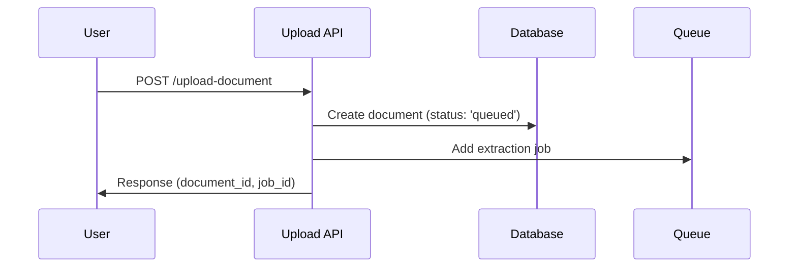
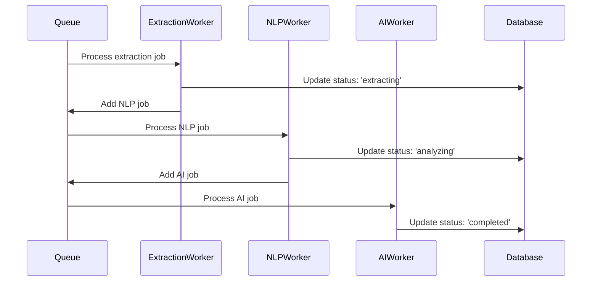

# Architecture du Système de Traitement Asynchrone

## 🎯 Vue d'Ensemble

Transformation du système actuel de traitement synchrone des documents vers une architecture asynchrone robuste et scalable.

## 📊 État Actuel vs Cible

### État Actuel (Synchrone)
```
Upload → Traitement → Réponse (blocage 10-60s)
```

### État Cible (Asynchrone)
```
Upload → Réponse immédiate (< 2s) → Traitement background → Notification
```

## 🏗 Architecture Technique

### Stack Technologique Choisie

| Composant | Technologie | Justification |
|-----------|-------------|---------------|
| **Queue System** | **Bull** | Mature, dashboard UI, retry logic intégré |
| **Storage Backend** | **Redis** | Rapide, persistant, adapté aux queues |
| **Workers** | **Node.js Process** | Intégration native avec Payload |
| **Monitoring** | **Bull Dashboard** | Interface web clé en main |

### Dépendances Existantes Réutilisées
- ✅ `pdf-parse` - Extraction PDF
- ✅ `mammoth` - Traitement DOCX  
- ✅ `epub-parser` - Lecture EPUB
- ✅ `node-nlp` - Analyse sémantique
- ✅ `@huggingface/inference` - IA enrichissement

### Nouvelles Dépendances Nécessaires
- `bull` - Queue management
- `ioredis` - Client Redis optimisé
- `bull-board` - Dashboard de monitoring

## 🔄 Types de Jobs Définis

### 1. **document-extraction**
```typescript
interface ExtractionJob {
  documentId: string
  fileType: 'pdf' | 'epub' | 'docx' | 'txt'
  sourceFileId: string
  priority: 'high' | 'normal' | 'low'
}
```

### 2. **nlp-processing** 
```typescript
interface NLPJob {
  documentId: string
  extractedText: string
  language: 'fr' | 'en'
  features: ['keywords', 'summary', 'sentiment']
}
```

### 3. **ai-enrichment**
```typescript
interface AIJob {
  documentId: string
  contentType: 'medical' | 'general'
  tasks: ['summary', 'quiz-generation', 'concept-extraction']
}
```

### 4. **validation-check**
```typescript
interface ValidationJob {
  documentId: string
  validationType: 'medical' | 'quality' | 'plagiarism'
  rules: ValidationRule[]
}
```

## 🏭 Architecture des Workers

### Structure des Dossiers
```
src/
├── jobs/
│   ├── types.ts              # Interfaces des jobs
│   ├── queue.ts              # Configuration Bull
│   ├── workers/
│   │   ├── extractionWorker.ts
│   │   ├── nlpWorker.ts
│   │   ├── aiWorker.ts
│   │   └── validationWorker.ts
│   ├── processors/
│   │   ├── pdfProcessor.ts
│   │   ├── epubProcessor.ts
│   │   └── docxProcessor.ts
│   └── services/
│       ├── nlpService.ts
│       ├── aiService.ts
│       └── validationService.ts
```

## 📈 Workflow de Traitement

### Phase 1 : Upload & Queueing


### Phase 2 : Processing Pipeline


## 🎛 Configuration des Workers

### Worker de Base
```typescript
import Queue from 'bull'
import { processingQueue } from './queue'

// Configuration standard pour tous les workers
const workerConfig = {
  concurrency: 3,
  settings: {
    stalledInterval: 30 * 1000,
    maxStalledCount: 1,
  },
  defaultJobOptions: {
    removeOnComplete: 100,
    removeOnFail: 50,
    attempts: 3,
    backoff: {
      type: 'exponential',
      delay: 5000,
    },
  }
}
```

## 📊 Système de Status Extended

### États du Document
```typescript
type ProcessingStatus = 
  | 'queued'          // En attente de traitement
  | 'extracting'      // Extraction du contenu
  | 'analyzing'       // Analyse NLP 
  | 'enriching'       // Enrichissement IA
  | 'validating'      // Validation qualité
  | 'completed'       // Traitement terminé
  | 'failed'          // Erreur
  | 'retrying'        // Nouvelle tentative
```

### Logs Détaillés
```typescript
interface ProcessingLog {
  documentId: string
  timestamp: Date
  step: ProcessingStatus
  progress: number        // 0-100%
  message: string
  details?: any
  error?: string
}
```

## ⚡ Optimisations Performance

### Priorités des Jobs
- **High** : Documents < 1MB, types .txt
- **Normal** : Documents moyens, PDF standard
- **Low** : Gros fichiers, retraitements

### Parallélisation
- **Extraction** : 3 workers concurrents
- **NLP** : 2 workers (plus CPU intensive)
- **AI** : 1 worker (rate limiting API)

### Gestion Mémoire
- Limitation taille documents : 50MB max
- Nettoyage automatique des jobs terminés
- Compression des logs anciens

## 🔧 Endpoints de Monitoring

### Status & Progression
```
GET /api/documents/{id}/status
GET /api/documents/{id}/logs
GET /api/documents/{id}/progress
```

### Administration Jobs  
```
GET /api/jobs/stats
GET /api/jobs/{id}
POST /api/jobs/{id}/retry
DELETE /api/jobs/{id}
```

### Dashboard Bull (Dev/Admin)
```
GET /admin/jobs
```

## 🛡 Gestion des Erreurs

### Stratégie de Retry
1. **Erreur temporaire** → Retry automatique (3x)
2. **Erreur de format** → Échec définitif + log
3. **Erreur API** → Retry avec backoff exponentiel
4. **Timeout** → Retry avec timeout augmenté

### Recovery
- **Redis down** → Jobs persistés, redémarrage auto
- **Worker crash** → Job remis en queue
- **Payload down** → Pause des workers

## 📋 Métriques & Alertes

### Métriques Clés
- Temps moyen de traitement par type
- Taux de succès/échec
- Queue depth et latency
- Utilisation CPU/mémoire workers

### Seuils d'Alerte
- Queue > 100 jobs en attente
- Temps traitement > 5 minutes  
- Taux échec > 10%
- Worker down > 1 minute

## 🚀 Plan de Déploiement

### Phase 1 : Infrastructure
- Setup Redis
- Installation Bull + Dashboard
- Configuration workers de base

### Phase 2 : Migration Progressive  
- Nouveaux uploads → Asynchrone
- Anciens uploads → Synchrone (coexistence)
- Migration data existante

### Phase 3 : Optimisation
- Fine-tuning performances
- Ajout métriques avancées
- Interface temps réel

---

## 🎯 Bénéfices Attendus

- **Performance** : Upload 20x plus rapide (2s vs 40s)
- **Scalabilité** : 100+ documents concurrents vs 1 seul
- **Fiabilité** : Retry automatique + recovery
- **Monitoring** : Visibilité complète du pipeline
- **UX** : Interface non-bloquante + progress tracking

Cette architecture nous permettra de gérer efficacement la croissance du volume de documents tout en améliorant drastiquement l'expérience utilisateur.