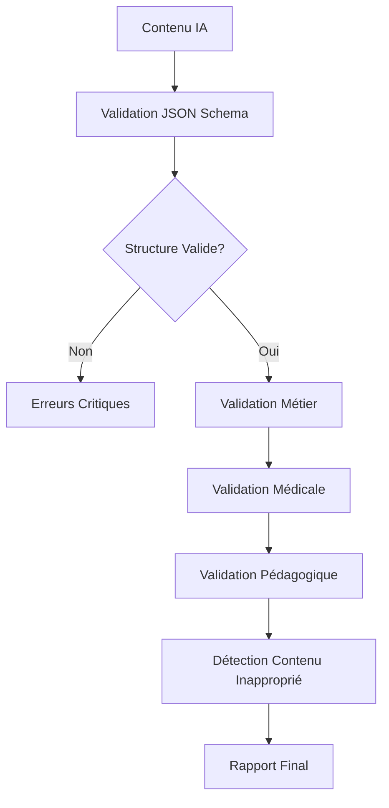

# Système de Validation pour les Quiz Générés par IA

## Vue d'ensemble

Le système de validation pour les quiz générés par IA comprend plusieurs couches de validation pour garantir la qualité, la sécurité et la pertinence pédagogique du contenu généré. Il est conçu pour valider les quiz médicaux selon les niveaux d'études (PASS/LAS) et détecter le contenu inapproprié.

## Architecture du Système

### Composants Principaux

1. **JSONSchemaValidatorService** - Validation stricte de la structure JSON
2. **EnhancedContentValidatorService** - Validation avancée avec règles métier
3. **ContentValidatorService** - Service principal avec rétrocompatibilité
4. **aiQuizValidationSchema** - Schémas et règles de validation

### Flux de Validation



## Services de Validation

### 1. JSONSchemaValidatorService

**Responsabilité**: Validation stricte de la structure JSON selon le schéma défini.

**Fonctionnalités**:
- Validation de la structure de base
- Vérification des types de données
- Contrôle des contraintes (longueur, plages de valeurs)
- Nettoyage et sanitisation du contenu

**Utilisation**:
```typescript
const validator = new JSONSchemaValidatorService();
const result = validator.validateQuizStructure(content);

if (!result.isValid) {
  console.log('Erreurs de structure:', result.errors);
}
```

### 2. EnhancedContentValidatorService

**Responsabilité**: Validation avancée avec règles métier, validation médicale et pédagogique.

**Fonctionnalités**:
- Validation par niveau d'études (PASS/LAS)
- Détection de contenu inapproprié
- Analyse de la terminologie médicale
- Génération de recommandations
- Scoring détaillé par catégorie

**Utilisation**:
```typescript
const validator = new EnhancedContentValidatorService();
const result = await validator.validateAIGeneratedQuiz(content, 'PASS');

console.log('Score global:', result.score);
console.log('Scores par catégorie:', result.categoryScores);
console.log('Recommandations:', result.recommendations);
```

### 3. ContentValidatorService

**Responsabilité**: Service principal maintenant la rétrocompatibilité et exposant les nouvelles fonctionnalités.

**Fonctionnalités**:
- API compatible avec l'ancienne version
- Méthodes spécialisées par niveau (PASS/LAS)
- Détection de contenu inapproprié
- Validation du vocabulaire médical

**Utilisation**:
```typescript
const validator = new ContentValidatorService();

// Validation classique (rétrocompatible)
const basicResult = validator.validateAIGeneratedQuiz(content);

// Validation améliorée
const enhancedResult = await validator.validateAIGeneratedQuizEnhanced(content, 'PASS');

// Validation spécialisée
const passResult = await validator.validateForPASS(content);
const lasResult = await validator.validateForLAS(content);
```

## Schémas de Validation

### Structure JSON Attendue

```json
{
  "quiz": {
    "title": "Titre du quiz (10-100 caractères)",
    "description": "Description détaillée (20-300 caractères)",
    "estimatedDuration": 15
  },
  "questions": [
    {
      "questionText": "Texte de la question (20-500 caractères)",
      "options": [
        {
          "text": "Option A (5-200 caractères)",
          "isCorrect": false
        },
        {
          "text": "Option B (5-200 caractères)",
          "isCorrect": true
        },
        {
          "text": "Option C (5-200 caractères)",
          "isCorrect": false
        },
        {
          "text": "Option D (5-200 caractères)",
          "isCorrect": false
        }
      ],
      "explanation": "Explication détaillée (50-1000 caractères)",
      "difficulty": "easy|medium|hard",
      "tags": ["tag1", "tag2"]
    }
  ]
}
```

### Règles de Validation par Niveau

#### PASS (1ère année)
- **Vocabulaire**: Basique, fondamental
- **Concepts**: Anatomie, physiologie, biochimie de base
- **Difficulté maximale**: Medium
- **Contenu clinique**: Non autorisé
- **Termes requis**: anatomie, physiologie, cellule, tissu, organe
- **Termes interdits**: diagnostic clinique, chirurgie, prescription

#### LAS (Licence Accès Santé)
- **Vocabulaire**: Intermédiaire
- **Concepts**: Pathologie, symptômes, prévention
- **Difficulté maximale**: Hard
- **Contenu clinique**: Autorisé (niveau basique)
- **Termes requis**: pathologie, symptôme, diagnostic, prévention
- **Termes interdits**: chirurgie spécialisée, thérapeutique expérimentale

## Détection de Contenu Inapproprié

### Catégories de Contenu Détectées

1. **Conseils médicaux dangereux**
   - Auto-médication
   - Diagnostic personnel
   - Remèdes miracles

2. **Contenu discriminatoire**
   - Stéréotypes raciaux
   - Discrimination sexuelle

3. **Pseudo-science**
   - Théories du complot
   - Médecine alternative exclusive

4. **Contenu alarmiste**
   - Panique sanitaire
   - Catastrophisme

### Patterns de Détection

```typescript
const INAPPROPRIATE_CONTENT_PATTERNS = {
  medicalAdvice: [
    /auto.?médication/i,
    /diagnostic.?personnel/i,
    /remède.?miracle/i
  ],
  discriminatory: [
    /race.?supérieure/i,
    /stéréotype.?racial/i
  ],
  // ... autres patterns
};
```

## Système de Scoring

### Scores par Catégorie

- **Structure** (30%): Validation JSON, cohérence des données
- **Contenu** (25%): Qualité métier, logique des questions
- **Médical** (25%): Terminologie, précision scientifique
- **Pédagogique** (20%): Adaptation au niveau, progression

### Seuils de Qualité

- **Score minimum global**: 70/100
- **Erreurs critiques tolérées**: 0
- **Erreurs majeures tolérées**: 2
- **Ratio terminologie médicale minimum**: 30%

## Rapports de Validation

### Rapport Standard
```
=== RAPPORT DE VALIDATION ===
Score global: 85/100
Statut: ✅ VALIDE

PROBLÈMES DÉTECTÉS (2):
1. 🟠 Question trop courte
   Champ: questions[0].questionText
   Suggestion: Développer la question

AVERTISSEMENTS (1):
1. ⚠️ Terminologie médicale faible
   Suggestion: Utiliser plus de termes spécialisés
```

### Rapport Détaillé
```
=== RAPPORT DE VALIDATION DÉTAILLÉ ===

📊 SCORES GLOBAUX
Score global: 85/100 ✅
Structure: 95/100
Contenu: 80/100
Médical: 75/100
Pédagogique: 90/100

📈 MÉTADONNÉES
Niveau: PASS
Ratio terminologie médicale: 45%
Longueur moyenne des questions: 120 caractères
Temps de traitement: 150ms

💡 RECOMMANDATIONS (2)
1. 🔥 Enrichir le vocabulaire médical
   Catégorie: medical
   Justification: Améliorer la spécialisation du contenu
```

## Intégration et Utilisation

### Dans le Service de Génération IA

```typescript
import { ContentValidatorService } from '../services';

export class AIQuizGenerationService {
  private validator = new ContentValidatorService();

  async generateQuiz(config: GenerationConfig): Promise<Quiz> {
    // 1. Générer le contenu avec l'IA
    const aiContent = await this.generateWithAI(config);

    // 2. Valider le contenu
    const validation = await this.validator.validateAIGeneratedQuizEnhanced(
      aiContent, 
      config.studentLevel
    );

    // 3. Vérifier la validité
    if (!validation.isValid) {
      throw new ValidationError('Contenu invalide', validation.issues);
    }

    // 4. Créer le quiz si valide
    return this.createQuizFromValidatedContent(aiContent, validation);
  }
}
```

### Dans les Endpoints API

```typescript
import { ContentValidatorService } from '../services';

export const validateQuizContent = async (req: Request, res: Response) => {
  const validator = new ContentValidatorService();
  const { content, studentLevel } = req.body;

  try {
    const result = await validator.validateAIGeneratedQuizEnhanced(
      content, 
      studentLevel
    );

    res.json({
      isValid: result.isValid,
      score: result.score,
      issues: result.issues,
      recommendations: result.recommendations
    });
  } catch (error) {
    res.status(500).json({ error: 'Erreur de validation' });
  }
};
```

## Tests et Qualité

### Tests Unitaires

Le système inclut une suite complète de tests couvrant:
- Validation de structure JSON
- Détection de contenu inapproprié
- Validation par niveau d'études
- Génération de rapports
- Gestion des cas limites

### Exécution des Tests

```bash
npm run test:vitest src/services/__tests__/ContentValidation.test.ts
```

### Couverture de Tests

- **JSONSchemaValidatorService**: 100%
- **EnhancedContentValidatorService**: 95%
- **ContentValidatorService**: 100%
- **Schémas de validation**: 100%

## Maintenance et Évolution

### Ajout de Nouveaux Patterns

Pour ajouter de nouveaux patterns de détection:

1. Modifier `INAPPROPRIATE_CONTENT_PATTERNS` dans `aiQuizValidationSchema.ts`
2. Ajouter les tests correspondants
3. Mettre à jour la documentation

### Modification des Seuils

Les seuils de qualité peuvent être ajustés dans `QUALITY_THRESHOLDS`:

```typescript
export const QUALITY_THRESHOLDS = {
  minimumValidationScore: 70, // Score minimum global
  minimumMedicalTerminologyRatio: 0.3, // 30% minimum
  maxCriticalErrors: 0,
  maxMajorErrors: 2
};
```

### Ajout de Nouveaux Niveaux

Pour ajouter un nouveau niveau d'études:

1. Étendre le type `StudentLevel`
2. Ajouter les règles dans `LEVEL_SPECIFIC_VALIDATION_RULES`
3. Mettre à jour les services de validation
4. Ajouter les tests correspondants

## Bonnes Pratiques

### Utilisation Recommandée

1. **Toujours valider** le contenu généré par l'IA
2. **Utiliser le niveau approprié** (PASS/LAS) pour la validation
3. **Examiner les recommandations** pour améliorer la qualité
4. **Loguer les résultats** de validation pour le monitoring
5. **Implémenter des fallbacks** en cas d'échec de validation

### Gestion des Erreurs

```typescript
try {
  const result = await validator.validateAIGeneratedQuizEnhanced(content, level);
  
  if (!result.isValid) {
    // Loguer les problèmes
    logger.warn('Validation failed', { 
      issues: result.issues,
      score: result.score 
    });
    
    // Décider de l'action (retry, fallback, etc.)
    if (result.score < 50) {
      throw new Error('Contenu de qualité insuffisante');
    }
  }
} catch (error) {
  // Gestion d'erreur appropriée
  logger.error('Validation error', error);
  throw new ValidationError('Échec de la validation', error);
}
```

## Monitoring et Métriques

### Métriques Recommandées

- Taux de validation réussie
- Score moyen par catégorie
- Temps de traitement moyen
- Types d'erreurs les plus fréquents
- Ratio de contenu inapproprié détecté

### Alertes

- Score de validation < 60
- Détection de contenu inapproprié
- Temps de traitement > 5 secondes
- Taux d'échec > 10%