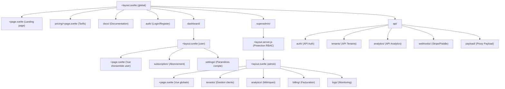

# Architecture des routes SvelteKit

Cette arborescence décrit l’organisation des routes pour le SaaS : vitrine publique, portail utilisateur, dashboard superadmin, endpoints BFF, etc.

> Copie-colle ce bloc Mermaid dans Notion ou un éditeur compatible pour obtenir une vue arborescente visuelle.

## Bonnes pratiques

- **Séparation claire** entre espace public, utilisateur et superadmin.
- **Protection server-side** dans `superadmin/+layout.server.js` (RBAC).
- **Endpoints BFF** dans `/api/` pour centraliser l’orchestration avec Payload et Stripe.
- **Extensibilité** : chaque dossier peut être enrichi avec des sous-routes ou des composants spécifiques.

---

> Ce fichier sert de référence d’architecture et doit être mis à jour à chaque évolution majeure des routes ou des accès.
